# LAB: Color Image Segmentation - Magic Cloak


**Date:** 2025-04-18

**Author:** HyeonGyu Seo 22000355

**Github:** [Github](https://github.com/shg0873/DLIP/tree/main/LAB_Grayscale_Image_Segmentation-Gear)

**Demo Video: **  [Sample 2](https://youtu.be/Mcdp31H6d3I)

<hr>

## Contents

[Introduction](#introduction)

* [1. Objective](#1.-objective)
* [2. Preparation](#2-preparation)  
*  [Algorithm-Sample 1](#algorithm-sample-1)

- [Algorithm‑Sample 2](#algorithm-sample-2)  
- [Result and Discussion](#result-and-discussion)  
- [Appendix](#appendix)

## Introduction

### 1. Objective

Goal: Invisible Cloak

The goal of this project is to create a basic OpenCV program that makes a person wearing a cloak appear invisible.

This is done by detecting the cloak based on its color and replacing it with the background image, so it looks like the person disappears.

The program uses simple image processing techniques like color detection, masking, and background subtraction to achieve this visual effect. This project helps demonstrate how computer vision can be used to create optical illusions and can be a starting point for more advanced augmented reality systems.

### 2. Preparation

#### Software Installation

- OpenCV 3.83
- Clion

#### Dataset

* **Sample 1**
  * Dataset link: [Download the test video]()


<hr>

## Algorithm-Sample 1

### 1. Overview

The image below is a flowchart representing the entire algorithm process.

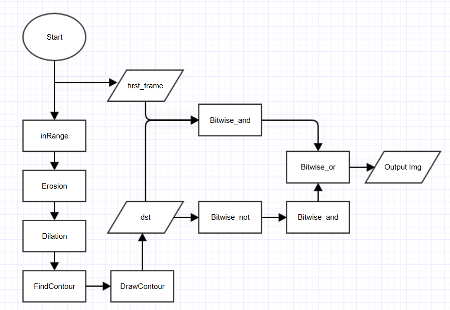


### 2. Procedure

#### cvtColor

**HSV** expresses **color (Hue)**, **saturation (Saturation)**, and **value (Brightness)** separately, so it can extract color information more intuitively than BGR, and it is relatively robust to brightness changes and lighting conditions. 

In particular, for tasks such as object tracking or color filtering, it is much more efficient than BGR because it is easy to specify a specific color range with only the Hue value. 

In addition, **HSV** expresses color similarly to the way humans visually perceive color, so it is often used as a color space that is more suitable for color-based processing.

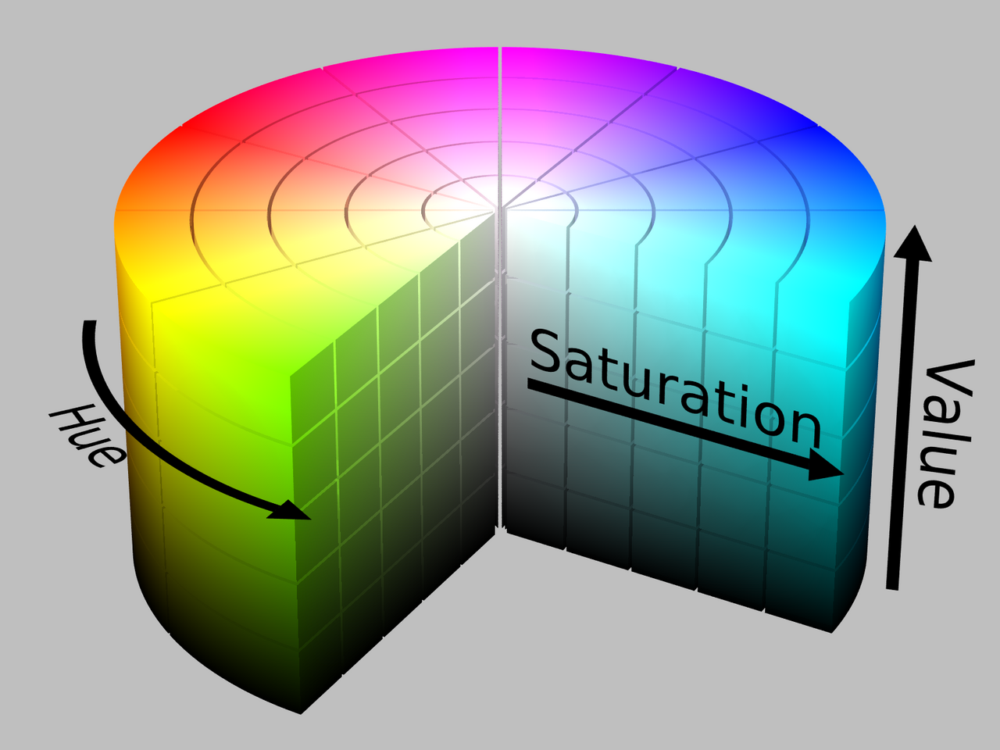

#### inRange

The `inRange` function extracts color information between the min and max values specified for each dimension of the color space that constitutes the image. For three-channel arrays: If the formula below is satisfied, 255 is stored and the remaining pixels are initialized to 0.
$$
dst(I)=[min(I_0)<src(I_0)<max(I_0)]\&~~~~~~~~~~~~~~~~\\ [min(I_1)<src(I_1)<max(I_1)]\&\\ ~~~~[min(I_2)<src(I_2)<max(I_2)]=1
$$

#### Erosion & Dilation

Even after going through the `inRange` process, a process of removing noise caused by various factors in the real environment is necessary. The noise is removed through the `Erosion` function, and then one Magic box is created through the `Dilation` function.

Since only the desired color information is extracted with `inRange`, the noise is not large. The structure size is `3x3` enough. Since the magic box is a square, the shape is set to `MORPH_RECT`.
$$
EROSION: {[z | (B)_Z\in A]}=[z | (B)_Z\cap A^c=\emptyset]\\~~~~~~~~
DILATION: {[z | (B)_Z\cap A \neq\emptyset]}=[z | [(B)_Z\cap A]\in \emptyset]
$$
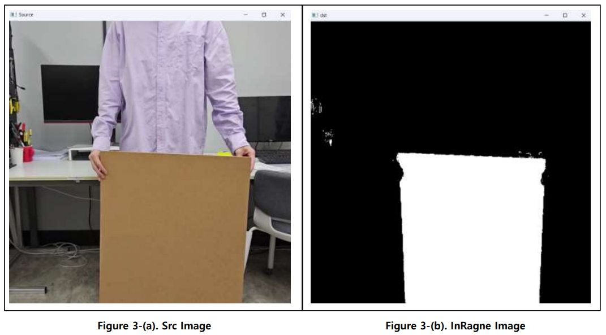

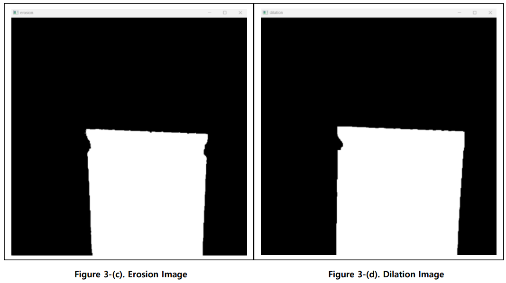

#### Find Contours & Draw Contours

We use the `findcontours` function to get contour information of a **magic box**. Each contour is stored as a point vector. 

Due to noises that are not removed through pre-processing, various contour information other than the magic box may be stored. Using `contourArea`, only information on contours larger than a certain size (ex. Magic box) is used. 

If you set the thickness parameter of `drawContours` to `FILLED`, you can obtain a matrix that fills the area inside the contour.

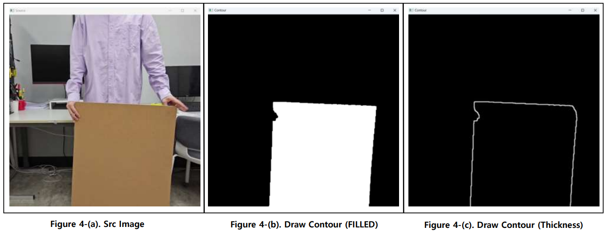

#### Bitwise 

A matrix that only has magic box information is converted to a matrix that has information about pixels other than magic boxes through the `bitwise_not` operation.
$$
Back(I)=\sim M.B(I)
$$

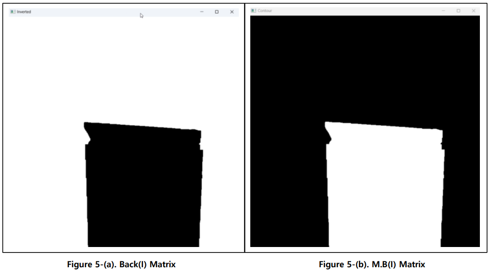

First frame with no people and only background image, and Magic box are `bitwise_and` computed, and each frame and the part that is not Magic box are `bitwise_and` computed to obtain two frames.
$$
A(I)=M.B(I)\&F.1st(I)\\
B(I)=Back(I)\&F(I)~~~~~~\\
Out(I)=A(I)||B(I)~~~~~~~~~~~~~~~~~
$$
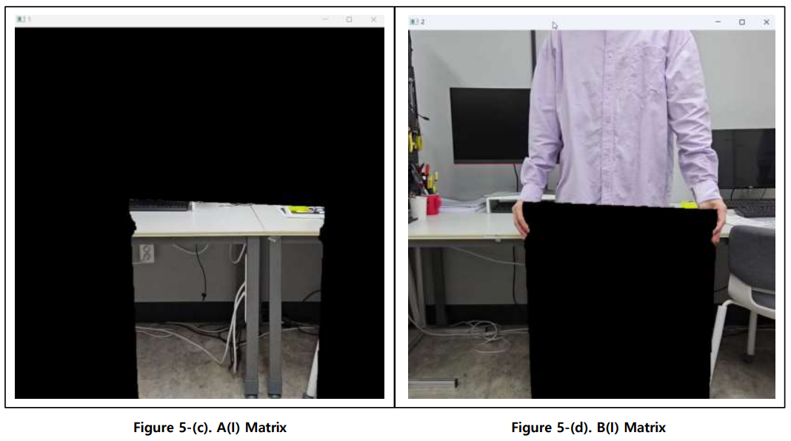

<hr>

## Algorithm-Sample 2

### 1. Overview

The goal of this project is to detect the cloak based on its color and replace it with an image of human anatomy, making the inside of the body visible, like an X-RAY.

The program uses simple image processing techniques such as color detection, masking, and background removal to achieve this visual effect. This project demonstrates how to create optical illusions using computer vision, and could be a starting point for a more advanced augmented reality system.


### 2. Procedure

#### cvtColor

**HSV** expresses **color (Hue)**, **saturation (Saturation)**, and **value (Brightness)** separately, so it can extract color information more intuitively than BGR, and it is relatively robust to brightness changes and lighting conditions. 

In particular, for tasks such as object tracking or color filtering, it is much more efficient than BGR because it is easy to specify a specific color range with only the Hue value. 

In addition, **HSV** expresses color similarly to the way humans visually perceive color, so it is often used as a color space that is more suitable for color-based processing.


#### inRange

The `inRange` function extracts color information between the min and max values specified for each dimension of the color space that constitutes the image. 

To implement X-RAY, prepare human anatomy bone images and muscle images. After that, the part excluding muscles and bones will replace the background with the first frame of the video. To do this, `bitwise` calculations will be performed, and the white background of the prepared bone and muscle images needs to be excluded.
$$
dst(I)=[min(I_0)<src(I_0)<max(I_0)]\&~~~~~~~~~~~~~~~~\\ [min(I_1)<src(I_1)<max(I_1)]\&\\ ~~~~[min(I_2)<src(I_2)<max(I_2)]=1
$$


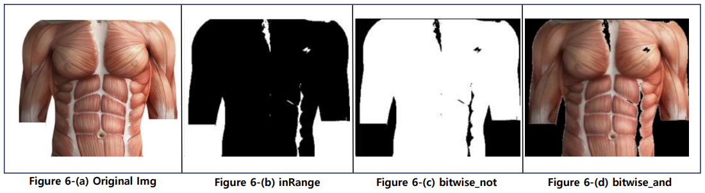

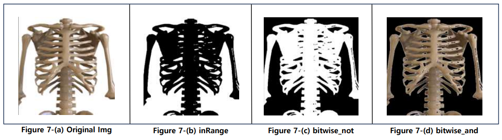

#### Dilation

Once the bone and muscle images are ready, we need to find the human body and create an image that combines the bones and muscles.
Extract the human clothes as a mask in the `HSV` color space. Human clothes will usually have a lot of noise due to fluff or lighting. We use the `morphologyEx` function to **DILATION** this. Through this, we are ready to obtain the outline information of the entire human upper body.
$$
DILATION: {[z | (B)_Z\cap A \neq\emptyset]}=[z | [(B)_Z\cap A]\in \emptyset]
$$

#### Find Contours & Bounding Rect

If you have obtained the outlines containing pixels corresponding to the clothes of the upper body of a person through `findContours`, you can use the `boundingRect` function to obtain the minimum size rectangle (bounding box) that surrounds the given point. It returns the `x, y` coordinates of the upper left corner, and `width` and `height` values of the bounding box.

#### Resize

Using the coordinate values of the upper body and the `width` and`height` obtained through `boundingRect`, the prepared human anatomy photo is **resized** and combined with the original frame to create two background images to be used in X-RAY.

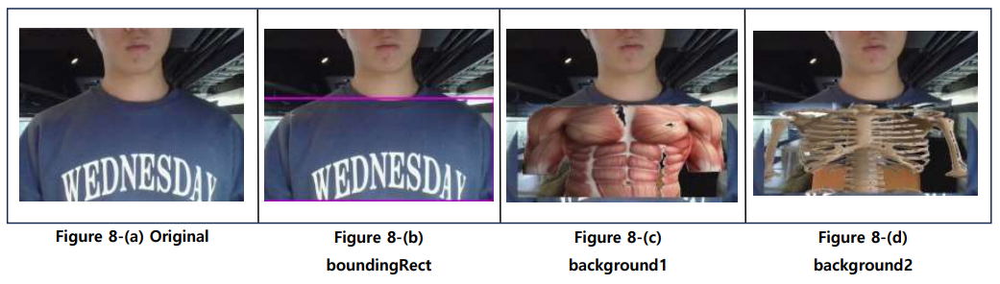

#### CopyTo

Just like we did in Sample 1, we can extract the color information of the green and red cards to create a mask, and copy `background1` if it's green and `background2` if it's red to the mask area of the frame to get a result similar to viewing an X-RAY.

<hr>

## Result and Discussion

#### 1. Final Result

The green panel shows the muscle anatomy, and the red panel shows the bone anatomy. We were able to successfully extract the green and red `HSV`color information, which allows you to select and view the desired image.

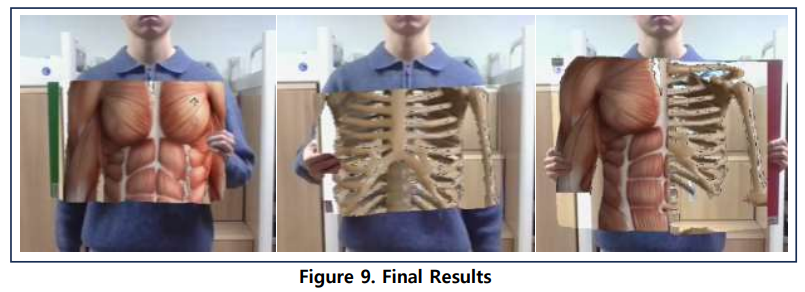

**Demo Video: **  [Sample 2](https://youtu.be/Mcdp31H6d3I)

#### 2. Conclusion

In this project, we implemented an interesting visual effect called ‘Magic Cloak’ using color-based image segmentation technology using OpenCV. In Sample 1, a cloak of a specific color was recognized and replaced with a background image to create an effect where the wearer seemed to disappear from the screen. This was achieved by integrating basic image processing techniques such as color detection, mask generation, morphological operations, and bit operations.

In Sample 2, we implemented an X-RAY effect that displays muscle anatomy and bone anatomy using green and red panels, respectively, as an extended concept. To do this, we recognized the position of the upper body of a person, aligned the position and size of the anatomical image, and then used a color mask to accurately overlay the image on the frame. Through this, we were able to experience the basic form of augmented reality beyond simple color segmentation.

<hr>

## Appendix

```c++
int main() {
    int num;
    cout << "Enter Sample Number (1 or 2): ";
    cin >> num;

    switch (num) {
        case 1:
            sample1();
            break;
        case 2:
            sample2();
            break;
        default:
            cout << "Invalid input" << endl;
    }
    return 0;
}
```

This is main code. The main function consists of two functions. Depending on the entered number, the code sample 1 or sample 2 will be executed.


#### Sample 1

```c++
void sample1() {
    Mat hsv, dst, frame, first_frame, inverted;
    vector<vector<Point>> contours;

    VideoCapture cap("../LAB_MagicCloak_Sample1.mp4");
    cap >> first_frame;  // 첫 번째 프레임을 배경으로 저장

    while (true) {
        cap >> frame;

        cvtColor(frame, hsv, COLOR_BGR2HSV);     // BGR에서 HSV 색상 공간으로 변환
        inRange(hsv,                      // 사전에 지정한 HSV 범위에 해당하는 마스크 생성
                Scalar(MIN(hmin, hmax), MIN(smin, smax), MIN(vmin, vmax)),  // 하한값
                Scalar(MAX(hmin, hmax), MAX(smin, smax), MAX(vmin, vmax)),  // 상한값
                dst);

        // 노이즈 제거: Erosion -> Dilation(Opening)
        Mat erodeElem = getStructuringElement(MORPH_RECT, Size(3, 3));
        Mat dilateElem = getStructuringElement(MORPH_RECT, Size(3, 3));
        morphologyEx(dst, dst, MORPH_ERODE, erodeElem, Point(-1, -1), 3);   // Erosion 3
        morphologyEx(dst, dst, MORPH_DILATE, dilateElem, Point(-1, -1), 5); // Dilation 5

        findContours(dst, contours, RETR_EXTERNAL, CHAIN_APPROX_SIMPLE);
        Mat dst_out = Mat::zeros(frame.size(), CV_8UC3);  

        if (!contours.empty()) {
            for (int i = 0; i < contours.size(); i++) {
                // 일정 면적 이상의 외곽선만 처리 (작은 노이즈 제거)
                if (contourArea(contours[i]) > 10000)
                    drawContours(dst_out, contours, i, Scalar(255, 255, 255), FILLED, 8); 
            }

            bitwise_not(dst_out, inverted);   // magic box 영역 반전
            bitwise_and(first_frame, dst_out, dst_out); // 배경 영상에서 magic box 영역 추출
            bitwise_and(frame, inverted, frame);  // 현재 프레임에서 magic box 영역 제거
            bitwise_or(frame, dst_out, frame);    // 배경 영역과 현재 프레임 합성
        }
        imshow("Magic_box", frame);
    }
}
```

> 1. The image that has gone through `cvtColor` and `inRange` pre-processing is used to extract only the pixels within a specified `HSV` range corresponding to the cloak color.
> 2. Using `morphologyEx` with erosion and dilation, we can remove small noise and enhance the mask shape for more reliable contour detection. 
> 3. Using `findContours`, we can obtain the external contours of the masked region.
> 4. For each valid contour (area > 10000), we fill it with white using `drawContours`, resulting in a binary mask that represents only the cloak area.
> 5. We then invert the cloak mask and apply `bitwise_and` and `bitwise_or` operations to remove the cloak region from the current frame and fill it with pixels from the background frame, creating the invisibility effect.

#### Sample 2

```c++
void sample2() {
    Mat frame, hsv, mask_person, muscle_resized, bone_resized, frame_result, green_card, red_card;

    VideoCapture cap(0); 

    Mat first_frame;
    cap >> first_frame; // 배경 프레임 저장 (투명화에 활용)

    Mat img_muscle = imread("../muscel.png", IMREAD_COLOR);     // 근육 이미지 불러오기 및 배경 제거 (흰 배경 제거)
    Mat muscle_mask, muscle;
    Scalar lower_white(200, 200, 200); Scalar upper_white(255, 255, 255);
    inRange(img_muscle, lower_white, upper_white, muscle_mask); // 흰색 마스크 생성
    bitwise_not(muscle_mask, muscle_mask);                      // 역마스크: 흰 배경 제외
    bitwise_and(img_muscle, img_muscle, muscle, muscle_mask);   // 근육 이미지에서 배경 제거

    while (true) {
        cap >> frame; 
        Mat background1 = frame.clone(); // 합성용 백업 프레임

        cvtColor(frame, hsv, COLOR_BGR2HSV);
        inRange(hsv, Scalar(111, 82, 94), Scalar(116,106,230), mask_person); // 사람 마스크

        Mat dilateElem = getStructuringElement(MORPH_RECT, Size(3, 3)); // 노이즈 제거 및 윤곽 강화를 위한 Dilation 연산
        morphologyEx(mask_person, mask_person, MORPH_DILATE, dilateElem, Point(-1, -1), 15); 

        findContours(mask_person, contours, RETR_EXTERNAL, CHAIN_APPROX_SIMPLE);
        Mat dst_out = Mat::zeros(frame.size(), CV_8UC3);

        if (!contours.empty()) {
            for (int i = 0; i < contours.size(); i++) {
                if (contourArea(contours[i]) > 65000)
                    body_rect = boundingRect(contours[i]); // 사람 윤곽 bounding box
            }
        }

        if (body_rect.width > 0 && body_rect.height > 0) {
            // 사람 크기에 맞춰 근육 이미지 리사이즈
            Size new_size(body_rect.width * scale, body_rect.height * scale);
            resize(muscle, muscle_resized, new_size);

            // 근육 이미지 위치 조정 (중앙 정렬)
            int muscle_x = body_rect.x + body_rect.width / 2 - muscle_resized.cols / 2;
            int muscle_y = body_rect.y + body_rect.height / 2 - muscle_resized.rows / 2;

            // 이미지 범위 확인 후, muscle 이미지 복사
            if (muscle_x >= 0 && muscle_y >= 0 &&
                muscle_x + muscle_resized.cols <= background1.cols &&
                muscle_y + muscle_resized.rows <= background1.rows) {

                Rect roi(muscle_x, muscle_y, muscle_resized.cols, muscle_resized.rows);
                muscle_resized.copyTo(background1(roi)); // 근육 이미지 합성

                // 합성 시 검은 영역은 배경으로 (first_frame) 대체
                for (int y = roi.y; y < roi.y + roi.height; y++) {
                    for (int x = roi.x; x < roi.x + roi.width; x++) {
                        if (background1.at<Vec3b>(y, x) == Vec3b(0, 0, 0)) {
                            background1.at<Vec3b>(y, x) = first_frame.at<Vec3b>(y, x);
                        }
                    }
                }
            }
        }

        // 초록색 카드 검출 (HSV 범위 지정)
        cvtColor(frame, hsv, COLOR_BGR2HSV);
        inRange(hsv, Scalar(50, 31, 0), Scalar(92, 219, 255), green_card); // 초록 마스크
        morphologyEx(green_card, green_card, MORPH_ERODE, dilateElem, Point(-1, -1), 5);
        morphologyEx(green_card, green_card, MORPH_DILATE, dilateElem, Point(-1, -1), 8);

        // 초록색 카드 위치에만 배경1(근육 합성된 프레임) 표시
        Mat frame_masked = frame.clone();
        background1.copyTo(frame_masked, green_card);

        imshow("Card Controlled Overlay", frame_masked); // 결과 영상 출력
    }
}

```

>1. Load the muscle image and create a mask to remove the white background using `inRange` and `bitwise_and`. <br>
>2. Capture the first webcam frame to use as a reference background for future blending. <br>
>3. In the loop, extract the person from the webcam input using `HSV` range and apply `morphologyEx` to enhance the mask. <br>
>4. Use `findContours` and `boundingRect` to locate the person's body region. <br>
>5. Resize the muscle image to fit the detected body region and copy it onto the corresponding region in the current frame. <br>
>6. If any black areas remain in the overlaid region (from the mask), replace them with the corresponding pixels from the first (background) frame. 
>7. Detect the green card using `HSV` filtering and morphological operations (`erode`, `dilate`) to refine the mask. <br>
>8. Only within the green card area, blend the muscle-overlaid frame onto the original input frame to produce the final output. <br>

