# LAB: Grayscale Image Segmentation -Gear <br>


**Date:**  2025-03-25

**Author:**  HyeonGyu Seo 22000355

**Github: [Github](https://github.com/shg0873/DLIP/tree/main/LAB_Grayscale_Image_Segmentation-Gear)**

**Demo Video: [Youtube](https://youtu.be/8SuJTRG_N7o)**

<hr>

# Contents
[Introduction](#introduction)<br>
   [1. Objective](#1-objective) <br>
   [2. Preparation](#2-preparation) <br><br>
[Algorithm](#algorithm)<br>
   [1. Overview](#1-overview)<br>
   [2. Procedure](#2-procedure)<br>
   [2-1 Median Blur](#median-blur)<br>
   [2-2 Thresholding](#thresholding)<br>
   [2-3 Get Gear Teeth](#get-gear-teeth)<br>
   [2-4 Defect criteria](#defect-criteria)<br>
   [2-5 Put Text](#puttext)<br><br>
[Result and Discussion](#result-and-discussion)<br>
   [1. Final Result](#1-final-result)<br>
   [2. Discussion](#2-discussion)<br><br>
[Conclusion](#conclusion)<br>
[Appendix](#appendix)
<hr>

# Introduction
## 1. Objective
Goal: Defective Gear Inspection System

Plastic gears are widely used in many applications, including toys, RC cars, and plastic-based hardware.
Since they are made of plastic, it is fragile and can have broken gear teeth. You are asked to develop a machine vision
system that can inspect defective plastic gears.<br>

After median filtering, applying thresholding, we can identify and extract the target objects from the
background by finding the contours around the connected pixels. Using percentage error with contourArea and averageArea we can distinguish defective gear teeth.


## 2. Preparation
### Software Installation

- OpenCV 3.83,  Clion

### Dataset

**Dataset link:** [Download the test image](https://github.com/shg0873/DLIP/tree/main/Lab_GrayScale_Gears)

<hr>


# Algorithm

## 1. Overview
The image below is a flowchart representing the entire algorithm process.

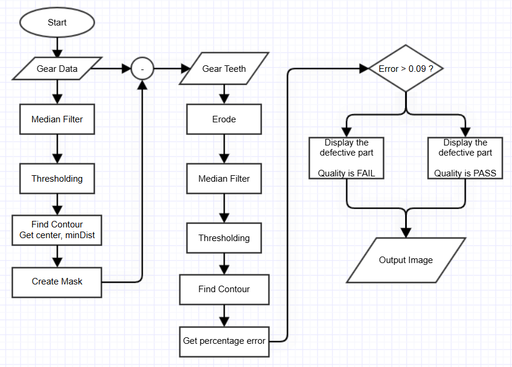<br>

## 2. Procedure

### Median Blur

Since the input image has empty pixels in Gear Body as seen in Figure 1(a), a Gaussian Blurring and Thresholding are applied.
After filtering the empty pixels in Gear Body are filled as seen in Figure 1(c).

Median Blur replaces the value with the middle of neighborhood set which determine by kernel size. 
If the kernel size is too large (e.g. more than 9), gear teeth with many defects may be regarded as noise and disappear, so a kernel size of around 3 is appropriate. <br><br>
<div align="center">
    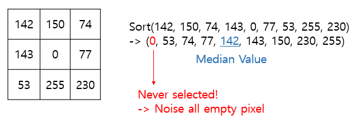
</div>

### Thresholding
Since the values of the image pixels after median filtering in the given sample image are concentrated in the range of 0 and 255,
it is okay to use the median value (125) as the threshold, but in order to be adaptable to all situations, the `THRESH_OTSU` method is used.<br>
OTSU method is Optimum threshold by maximizing the between-class variance. <br>
* $\eta$ is the score for 'goodness' of threshold value.
* $\sigma_G^2$ is the global variance
* $\sigma_B^2$ is the between-class variance
>$$\eta= {\sigma_B^2\over \sigma_G^2}$$
>$$\sigma_B^2=P_1(m_1-m_G)^2+P_2(m_2-m_G)^2 $$ 


<div align="center">
    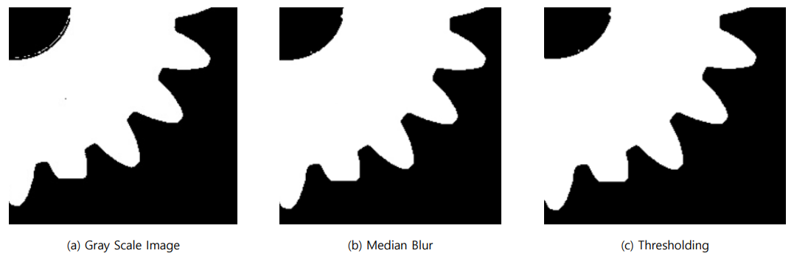
</div>

### Get Gear Teeth

To check for gear defects, a process is needed to leave only the gear teeth from the entire gear image. <br>
1. **Find contour** <br>
Use the `findcontours` function to obtain the outline information of the image. Each contour is stored as a vector of points.
   We use `RETR_EXTERNAL` because we need the entire boundary and `CHAIN_APPROX_NONE` to find all the contour points.
> `RETR_EXTERNAL`: Find only the outermost lines among the contour lines <br>
> `RETR_LIST`: Find all contour lines, but do not form a hierarchy <br>
> `RETR_CCOMP`: Find all contour lines, and form a hierarchy in 2 levels <br>
> `RETR_TREE`: Find all contour lines, and form all hierarchies <br><br>
> `CHAIN_APPROX_NONE`: Return all contour points <br>
> `CHAIN_APPROX_SIMPLE`: Return only points that can draw contour lines

2. **Approx Poly**<br>
Approximate the gear's outline with a polygon using the `approxPolyDP` function. It approximates a curve or a polygon with another curve/polygon with less vertices so that the distance between them is less or equal to the specified precision


3. **Get Gear Diameter (Root diameter)** <br>
Use the `minEnclosingCircle` function to find the radius from the center of the gear to the end circle. 
By comparing the distance between the `center point` and the `approximation points` obtained through `approxPolyDP`, we can obtain the radius to the root circle.


4. **Erode**<br>
A mask is created using the obtained center point and radius values, and Subtract the mask image from the original image, leaving only the gear teeth. 
Erosion of A by B is the set of all point z such that B, translated by z, is constrained in A. <br>
   Since the circle mask obtained by minDist has been subtracted once, the structure size of `3x3` is sufficient. Since the gear is circular, 
the shape is set to `MORPH_ELLIPSE`.
    * A is Image
    * B is filter
> $${[z | (B)_Z\in A]}=[z | (B)_Z\cap A^c=\emptyset]$$


5. After going through the processes above, only the Gear Teeth are left, and then the contour extraction process is performed for defect inspection. <br> 
Before that, since noises can be detected during processes such as erode, median blur and thresholding processes are applied once more. <br>

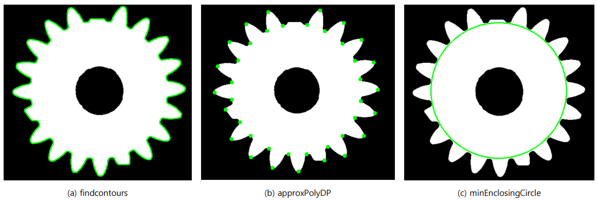<br>
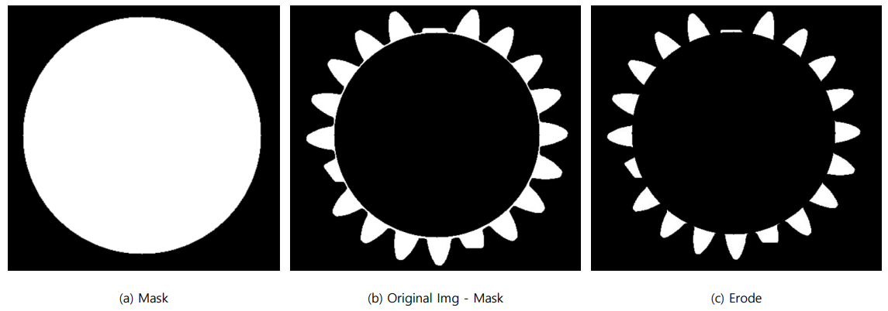


### Defect Criteria

The defect criterion for gear teeth is the percentage error from the average value of the gear tooth contour area and contour length.
If the percentage value exceeds 0.9, it is considered bad and marked as countour.
> $$A_{error}=\Big({{A_{contour}-A_{avg}}\over A_{avg} }\Big)>0.09$$
> $$L_{error}=\Big({{L_{contour}-L_{avg}}\over L_{avg} }\Big)>0.09$$
> $$\rightarrow Defective$$

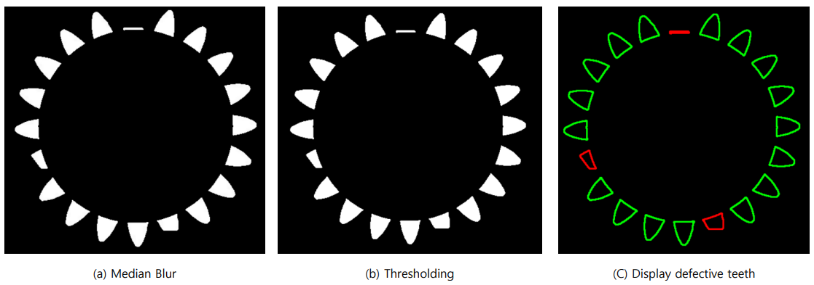


### PutText
Use the `putText` function to insert the contour area next to each gear tooth contour.
With the gear center pixel coordinates obtained through `minEnclosingCircle` and the center pixel coordinates of each contour obtained through the `moments` function,
we can obtain angle and distance information, and use these to enter the area next to each contour.
* $k$ is scale constance
 * $L$ is Root Diameter
 > $$contour\rightarrow (cx,cy)$$
> $$center\rightarrow (center.x, center.y)$$
> $$\theta=tan^{-1}\Big({-(cy-center.y)\over cx-center.x}\Big)$$
> $$TEXT_{pos}=\big(center.x + k\cdot L \cdot cos(\theta), center.y - k\cdot L \cdot sin(\theta)\big)$$
> 


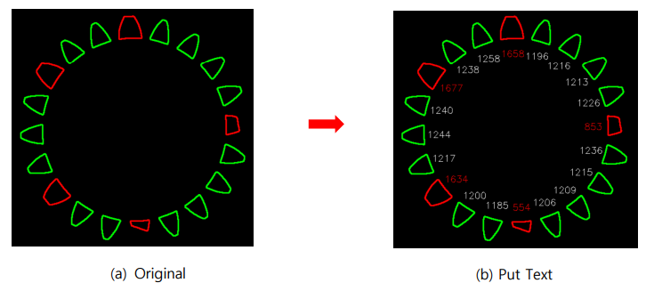

<hr>

# Result and Discussion

## 1. Final Result

The process of detecting defective parts in the Input Gear Image and indicating the location of the defect can be confirmed in the figure below. 
In addition, the number of gear teeth, gear root diameter, average gear tooth area, number of defective teeth, and quality
information for each gear can be confirmed in **2. Discussion**.
* Gear1 <br>
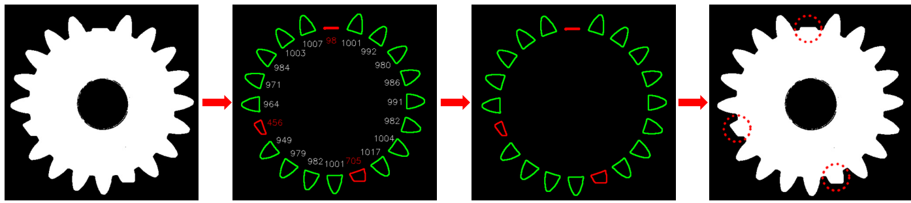
* Gear2 <br>
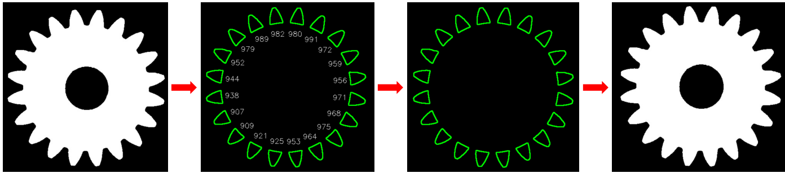
* Gear3 <br>
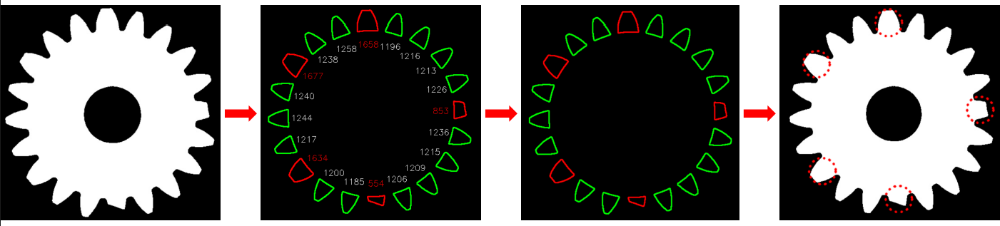
* Gear4 <br>
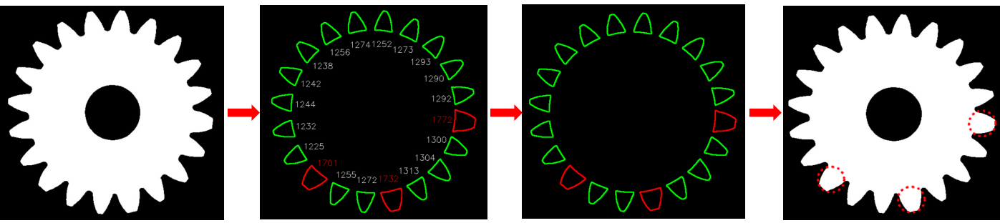


**Demo Video: [Youtube](https://youtu.be/8SuJTRG_N7o)**


## 2. Discussion


|                  |                                                                                                   Sample #1                                                                                                   |                                                                                                   Sample #2                                                                                                    |                                                                                                   Sample #3                                                                                                   |                                                                                                   Sample #4                                                                                                    |
|:----------------:|:-------------------------------------------------------------------------------------------------------------------------------------------------------------------------------------------------------------:|:--------------------------------------------------------------------------------------------------------------------------------------------------------------------------------------------------------------:|:-------------------------------------------------------------------------------------------------------------------------------------------------------------------------------------------------------------:|:--------------------------------------------------------------------------------------------------------------------------------------------------------------------------------------------------------------:|
|  Output Images   | 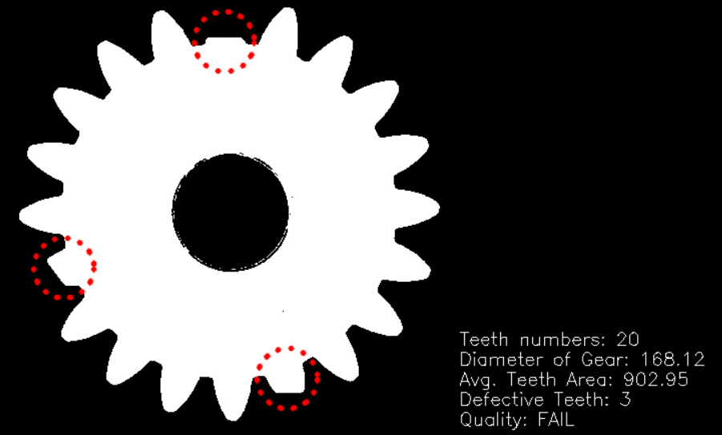 <br/>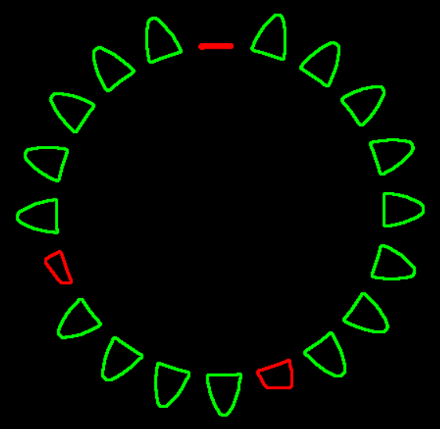<br/>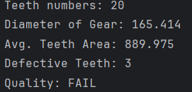 | 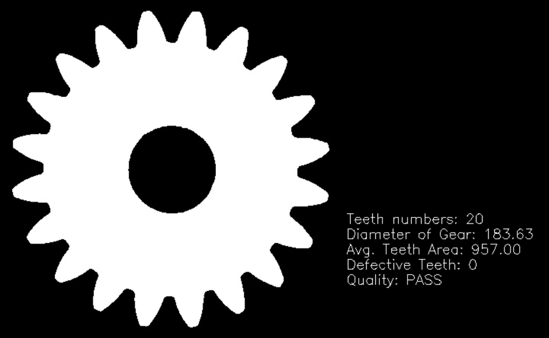 <br/>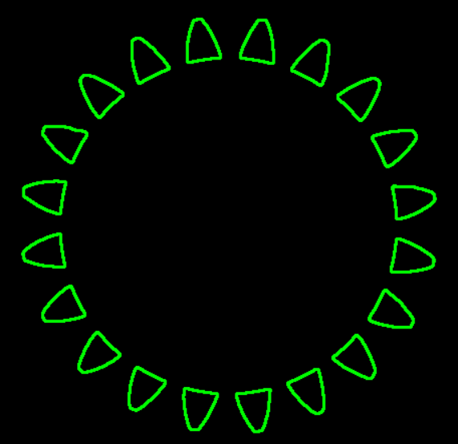 <br/>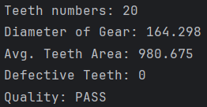 | 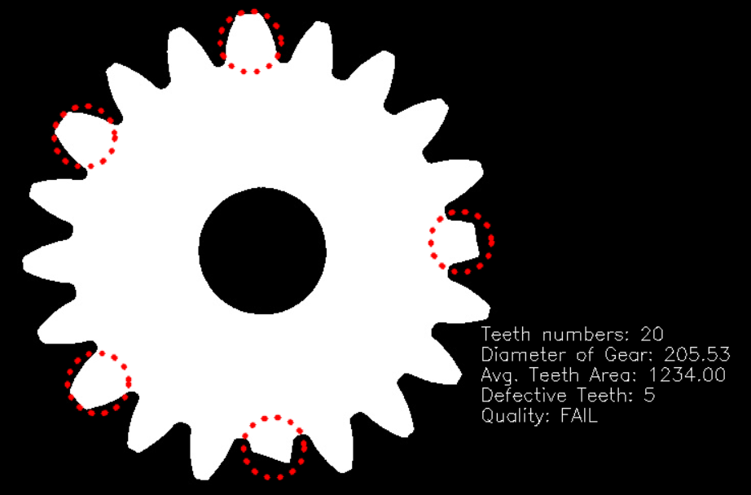 <br/>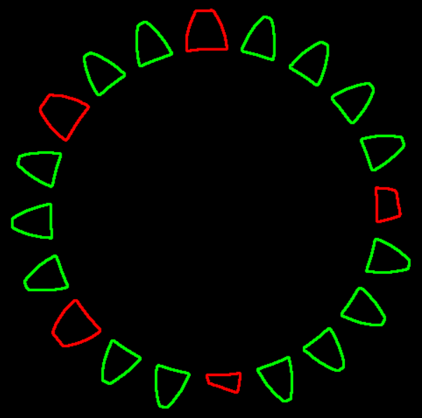<br/>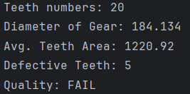 | 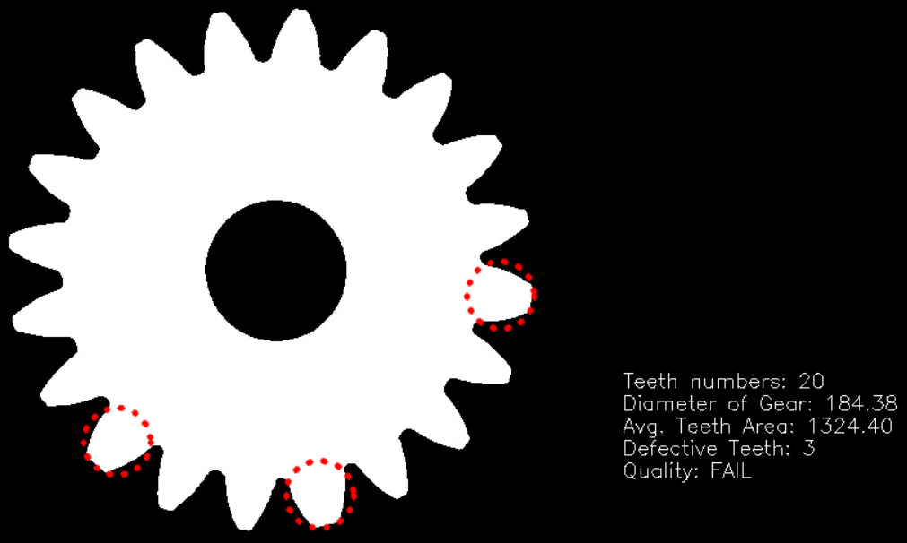 <br/>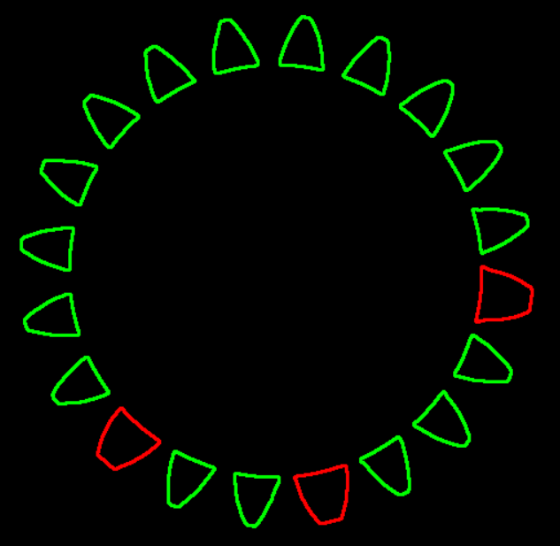 <br/>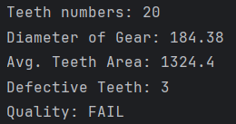 | 
|  Teeth numbers   |                                                                                                      20                                                                                                       |                                                                                                       20                                                                                                       |                                                                                                      20                                                                                                       |                                                                                                       20                                                                                                       |                                                               |
| Diameter of Gear |                                                                                                      165                                                                                                      |                                                                                                      164                                                                                                       |                                                                                                      184                                                                                                      |                                                                                                      184                                                                                                       | 
|  Avg.Teeth Area  |                                                                                                      890                                                                                                      |                                                                                                      981                                                                                                       |                                                                                                     1221                                                                                                      |                                                                                                      1324                                                                                                      |
| Defective Teeth  |                                                                                                       3                                                                                                       |                                                                                                       0                                                                                                        |                                                                                                       5                                                                                                       |                                                                                                       3                                                                                                        |
|     Quality      |                                                                                                     FAIL                                                                                                      |                                                                                                      PASS                                                                                                      |                                                                                                     FAIL                                                                                                      |                                                                                                      FAIL                                                                                                      |


Since the goal of this project is to detect defective gear teeth for each item and provide an assessment of their quality,
the proposed algorithm successfully achieved the project goal.


# Conclusion

Plastic gears are widely used in many applications including toys, RC cars, and plastic-based hardware.
Because they are made of plastic, they are fragile and the gear teeth can break. The goal of this project was to develop a machine vision system that can inspect plastic gears for defects.

To detect the contour of the gear teeth, we used the OpenCV function called `findContours` to calculate the average gear 
tooth area and percentage error, which were used as evaluation indicators to evaluate whether there were any defects. 
In this process, the accuracy of the machine vision greatly differed depending on whether the original image was pre-processed.

In the above algorithm, preprocessing was performed using `medianblur` and `threshold`. This is a necessary step to remove noise and obtain a clear contour.
If `medianblur` processing is not performed, noise is also calculated as contour, which causes a large error in calculating the `percentage error`. 
As you can see in the image below, the Teeth numbers are recognized as 24 due to noise, and most of the gear teeth are found to be defective.

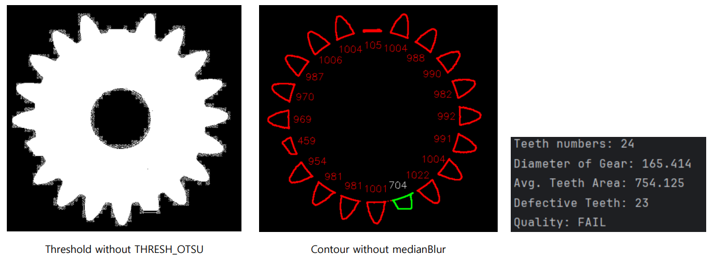


---

# Appendix

```c++
int main() {
    Mat src, src_color, erode;
    Point2f center;
    double minDist = 1e6;
    // Get Image Data
    src = imread("../../Image/Lab_GrayScale_Gears/Gear1.jpg", IMREAD_GRAYSCALE);
    cvtColor(src, src_color, COLOR_GRAY2BGR);
	
    // Get Gear teeth only
    get_gear_teeth(src, erode, center, minDist);

    // Find Defective Gear
    get_defective_gear(erode, src_color, center, minDist);

    waitKey(0);
    return 0;
}
```
This is main code. The main function consists of two functions. 
1. Extracts only the gear teeth from the original image. <br>
>```c++
> get_gear_teeth(src, erode, center, minDist)
>```
> * src     - Original Gear Image **[Matirx]**
> * erode   - Output Gear Image (Only gear teeth remain) **[Matirx]**
> * center  - Gear center pixel coordinate **[Point2f]**
> * minDist - Gear diameter (Root Diameter) **[double]**
> 
```c++
vector<vector<Point>> contours;  
float radius =0.;

// Pre-processing before find contour (Median filter % Thresholding)
Mat src_color, blur, thresh;
medianBlur(src, blur, 3); 
threshold(blur, thresh, -1, 255, THRESH_BINARY | THRESH_OTSU );

findContours(thresh, contours, RETR_EXTERNAL, CHAIN_APPROX_SIMPLE);

// Get approx point entire gear
double arclen = arcLength(contours[0], true);
std::vector<Point2f> approx;
approxPolyDP(contours[0], approx, 0.005 * arclen, true);

// Get center and root diameter(=minDist) of entire gear
minEnclosingCircle(contours[0], center, radius);
for (size_t i = 0; i < approx.size(); i++) {
    double dist = norm(approx[i] - center);
    if (dist < minDist) minDist = dist;
}

// Get Image with only the gear teeth remaining by subtracting the mask image from the original image
cvtColor(src, src_color, COLOR_GRAY2BGR);
Mat mask = Mat::zeros(src_color.size(), CV_8UC1);
circle(mask, center, static_cast<int>(minDist), Scalar(255), -1);

src_color.setTo(Scalar(0, 0, 0), mask);

// Morphology (erode) 
Mat kernel = getStructuringElement(MORPH_ELLIPSE, Size(5,5));
morphologyEx(src_color, erode, MORPH_ERODE, kernel, Point(-1,-1),1);
```
> 1. The image that has gone through `medianBlur` and `threshold` pre-processing is used to obtain the entire gear outline through `findContours`.
> <br><br>
> 2. Using `approxPolyDP`, we can approximate the entire gear outline using a repeated point array of the dedendum and addendum circles.
> <br><br>
> 3. Also using `minEnclosingCircle`, we can get center point and root diameter(=`minDist`).
> <br><br>
> 4. Create circle mask which diameter is `minDist`
> <br><br>
> 5. By subtracting the `mask` image from the original `src` and then performing `morpholohyEx`, we can obtain an image with only the gear teeth remaining.


2. Extracts the defective gear from the gear teeth.
>```c++
> get_defective_gear( erode, src, center, minDist)
>```
> * src     - Original Gear Image **[Matrix]**
> * erode   - Output Gear Image (Only gear teeth remain) **[Matrix]**
> * center  - Gear center pixel coordinate **[Point2f]**
> * minDist - Gear diameter (Root Diameter) **[double]** 
```c++
vector<vector<Point>> contours;

// Pre-processing before find contour (Median filter % Thresholding)
medianBlur(erode, blur2, 3);
threshold(blur2, thresh2, 0, 255, THRESH_BINARY | THRESH_OTSU);
// Get geer teeth contours
findContours(thresh2, contours, RETR_EXTERNAL, CHAIN_APPROX_SIMPLE);

// Calculate average contour area and average contour length
double totalArea = 0.0;
double totalLength = 0.0;
for( int i = 0; i< contours.size(); i++ ) {
    totalArea += contourArea(contours[i]);
    totalLength += arcLength(contours[i], true);
}

double avgArea = totalArea / contours.size();
double avgLength = totalLength / contours.size();
double area_percent_error   = 0.0;
double length_percent_error = 0.0;
int    num_defective_teeth = 0;

for (int i = 0; i < contours.size(); i++) {
    // Calculate Area percentage error and length percentage error for each geer tooth contour
    area_percent_error = abs((contourArea(contours[i]) - avgArea) / avgArea);
    length_percent_error = abs((arcLength(contours[i], true) - avgLength) / avgLength);

    // Get contour center point
    Moments M = moments(contours[i]);
    double cx = (M.m10 / M.m00);
    double cy = (M.m01 / M.m00);
    double angle = atan2(-(cy - center.y), cx - center.x);

    // Calculate text pixel position for put Text (contour area)
    Point2f min_pos = Point2f(center.x + 0.85*minDist * cos(angle), center.y - 0.85*minDist * sin(angle));
    Point2f text_pos = min_pos - Point2f(textSize.width / 2, -textSize.height / 2 );

    // Draw contours and put Text
    if (area_percent_error < 0.09 || length_percent_error < 0.09) {
        drawContours(output2, contours, i, Scalar(0,255,0), 2);
        drawContours(output3, contours, i, Scalar(0,255,0), 2);
        putText(output2, text, text_pos ,FONT_HERSHEY_SIMPLEX, 0.6, Scalar(255, 255, 255), 1);
    }else {
        drawContours(output2, contours, i, Scalar(0,0,255), 2);
        drawContours(output3, contours, i, Scalar(0,0,255), 2);
        putText(output2, text, text_pos,FONT_HERSHEY_SIMPLEX, 0.6, Scalar(0, 0, 255), 1);
        num_defective_teeth++;
    }
}

// Output the final result status
string Quality;
Quality = (num_defective_teeth > 0) ? "FAIL" : "PASS";
char buffer[200];

sprintf(buffer, "Teeth numbers: %d \nDiameter of Gear: %.2f\nAvg. Teeth Area: %.2f\nDefective Teeth: %d\nQuality: %s",
	(int)contours.size(), minDist, avgArea, num_defective_teeth, Quality.c_str());
```
> 1. The image that has gone through `medianBlur` and `threshold` pre-processing is used to obtain the gear teeth outlines through `findContours`.
<br><br>
> 2. The `area_percent_error` and `length_percent_error` evaluation metric is used to determine whether there is a defect or not, and the values required for this are calculated.
> <br><br>
> 3. If the error exceeds 0.09, it is considered defective and is displayed on the image using the `drawContour` and `putText`, and increase `num_defective_teeth`.
<br><br>
> 4. If the `num_defective_teeth` is bigger than 0, the string `Quailty` is FAIL.


