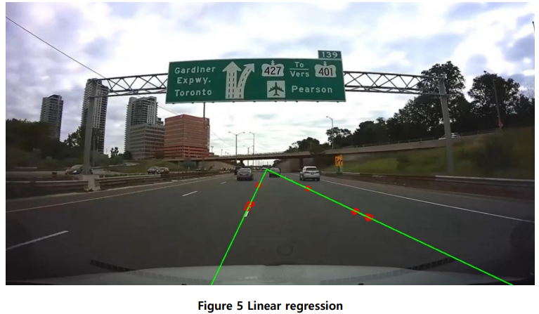

# LAB: Lane Detection <br>


**Date:**  2025-04-07

**Author:**  HyeonGyu Seo 22000355

**Github: [Github](https://github.com/shg0873/DLIP/tree/main/LAB_Lane_Detection)**

**Demo Video: [Youtube](https://youtu.be/gZ0gcyRrom4)**

<hr>

# Contents
[Introduction](#introduction)<br>
   [1. Objective](#1-objective) <br>
   [2. Preparation](#2-preparation) <br><br>
[Algorithm](#algorithm)<br>
   [1. Overview](#1-overview)<br>
   [2. Procedure](#2-procedure)<br>
   [2-1 ROI (Region Of Interest)](#roi-region-of-interest-)<br>
   [2-2 Gaussian Blur](#gaussian-blur)<br>
   [2-3 Canny Edge Detection](#canny-edge-detection)<br>
   [2-4 HoughlinesP](#houghlinesp)<br>
   [2-5 Linear regression](#linear-regression)<br><br>
[Result and Discussion](#result-and-discussion)<br>
   [1. Final Result](#1-final-result)<br>
   [2. Discussion](#2-discussion)<br><br>
[Conclusion](#conclusion)<br>
[Appendix](#appendix)
<hr>

# Introduction
## 1. Objective
Goal: Lane Detection and calculate vanishing point

One of the important parts of autonomous driving is the lane keeping algorithm. The goal of this report is to detect lanes
and calculate vanishing points using the OpenCV `houghlinesP` function for an effective lane keeping algorithm to obtain 
information for lane keeping.
Additionally, the vanishing point and the left and right lane approximation equations are used to determine whether lane departure has occurred and display this on the image.

## 2. Preparation
### Software Installation

- OpenCV 3.83,  Clion

### Dataset

**Dataset link:**<br> [Download the test image1](https://github.com/shg0873/DLIP/blob/main/LAB_Lane_Detection/Lane_center.jpg)<br>
[Download the test image2](https://github.com/shg0873/DLIP/blob/main/LAB_Lane_Detection/Lane_center.jpg)

<hr>


# Algorithm

## 1. Overview
The image below is a flowchart representing the entire algorithm process.

<div align="center">
    
</div>
   
## 2. Procedure

### ROI (Region Of Interest) 
The purpose of this report is lane detection, the road area is set as the region of interest (ROI) and image preprocessing 
and lane detection are attempted in this ROI. 

<div align="center">
    
</div>


### Gaussian Blur

Canny edge detection acts as a sharpening filter, amplifying noise. So we use `GaussianBlur` before `Canny` for reducing 
the noise effect. The standard deviation of the x-direction and y-direction kernels was set to 1 and kerner size set to 3.

> $$G_\sigma(x,y)={1\over 2\pi\sigma^2}e^{-\Big({x^2\over 2\sigma_x^2}+{y^2\over 2\sigma_y^2}\Big)}$$

<div align="center">
    
</div>

### Canny Edge Detection
1. Calculate gradient<br>
It can find the derivative in the x, y direction and use this value to find the magnitude and direction of the gradient.
> $$M: ||f|| = \sqrt {f^2_x+f^2_y}$$ 
> $$\theta=tan^{-1}\Big({f_y\over f_x}\Big)$$
2. NMS (Non-maximum suppression) <br>
Eliminate the phenomenon where one edge is expressed by multiple pixels, only pixels with `local maximum` gradient size 
are set as edge pixels. Therefore, two pixels located in the gradient direction are examined to check if they are local maximums.
NMS is applied based on the direction of the gradient, a single edge can be selected. In other words, the thick edge problem 
that occurs when only Sobel is used can be improved.<br>
3. Hysteresis edge tracking<br>
When pixels with gradients between $T_{LOW}$ and $T_{HIGH}$ are connected, if they are connected to pixels with gradients 
higher than $T_{HIGH}$ are determined as edges. <br>


<div align="center">
    
</div>

### HoughlinesP
The equation of a straight line can be obtained by extracting the coordinates of the edge obtained through `Canny`.
The Hough transform returns the **$\rho$** and **$\theta$** through the polar coordinate system representation. 
The probabilistic Hough transform `HouglinesP` randomly extracts coordinates to detect a straight line and returns the start and end points of the detected straight line.
> $$\rho=x_icos\theta+y_isin\theta$$

For each edge of the image, increase the vote at $H[\rho_k, \theta_k]$ for each $\rho$ and $\theta$ obtained.
And find where $\hat H[\hat \rho, \hat \theta]$ score is at maximum. The detected line in the image  is given by $x=\hat \rho (cos\hat \theta), y=\hat \rho (sin\hat \theta)$.
<div align="center">
   
</div>

<div align="center">
    
</div>

### Linear regression
With `HoughlinesP` we can get many lines. We use Linear regression to determine one straight line per lane. We can 
calculate the slope of a straight line with `End & Start Point` and use the slope to determine whether it is the left or right lane.
Additionally, the vanishing point where the two lanes meet can be found by using the first-order approximation coefficients of each left and right lane.
> $$Slope =tan^{-1}\Big({E.y-S.y\over E.x-S.x}\Big)$$
> $$Slope<0\rightarrow Left$$
> $$Slope>0\rightarrow Right$$

> $$(x_1,y_1), (x_2,y_2),\cdots, (x_m,y_m)$$
> $$y=c_0x+c_1$$
> $$A = \begin{bmatrix} x_1^1 & x_1^0 \\ x_2^1 & x_2^0 \\ \vdots & \vdots \\ x_m^1 & x_m^0 \end{bmatrix},Y=\begin{bmatrix}y_1 \\ y_2 \\ \vdots \\ y_m\end{bmatrix}, C= [c_0, c_1]$$
> $$A^TA\cdot C=A^TY \rightarrow C=(A^TA)^{-1}A^TY$$

 

> $$X_{vanish}={b_l-b_r\over a_r-a_l}$$
> $$Y_{vanish}=(a_r\cdot X_{vanish}+b_r)=(a_l\cdot X_{vanish}+b_l)$$

<div align="center">
    
</div>

<div align="center">
    
</div>


<hr>

# Result and Discussion

## 1. Final Result

The result of lane detection is shown with lines and vanishing point in Figure 6. 

<div align="center">
    
</div>

**Demo Video: [Youtube](https://youtu.be/gZ0gcyRrom4)**


## 2. Discussion


|                  |                                                           Sample #1                                                            |                                                          Sample #2                                                           |
|:----------------:|:------------------------------------------------------------------------------------------------------------------------------:|:----------------------------------------------------------------------------------------------------------------------------:|
|   Output Image   |  <br>  |   <br>  |
|  Left Lane Gap   |                                                              359                                                               |                                                             123                                                              |
|  Right Lane Gap  |                                                              314                                                               |                                                             542                                                              |
| Vannishing Point |                                                           [586,366]                                                            |                                                          [573,371]                                                           |
|  Approximation   |                                  $L_y=-0.72\cdot L_x+789.61$<br/> $R_y=0.82\cdot L_x-117.04$                                   |                                $L_y=-2.07\cdot L_x+1559.34$<br/> $R_y=0.47\cdot L_x + 100.05$                                |
|  Lane departure  |                                                               X                                                                |                                                              O                                                               |

# Conclusion<br>

In this report, we covered the process of lane detection and vanishing point calculation using OpenCV's `HoughLinesP` algorithm. 
Through the basic implementation of the lane detection algorithm, which is one of the key elements for lane keeping, 
successfully extracted meaningful lane information from the image and calculated the vanishing point based on it.

In this report, we chose to use `HoughLinesP` instead of `HoughLines` because `HoughLines` only returns the parameters **$\rho, \theta$** of the straight line, 
whereas `HoughLinesP` directly provides the start and end coordinates of the line segment that can actually be drawn on the image. 
This allows us to process the location information of the lane more intuitively and precisely, and it also makes it much easier to find 
intersections for calculating vanishing points.

Although the experimental results showed good performance in some static images, it was difficult to fully respond with existing parameters (`Canny`, `HoughLinesP`, etc.) 
in an actual autonomous driving environment due to various variables such as lighting, weather, and road conditions. 
Therefore, in the future, deep learning-based lane recognition, and exception handling logic will be required.


---

# Appendix

```c++
int main()
{
    String filename = "../Lane_center.jpg";
    src = imread(filename, IMREAD_COLOR);
    int roi_rows = 3 * src.rows/5;

    //*=============================================== Pre-processing ===============================================*//
    preprocess(roi_rows);

    //*=============================================== Lane Detection ===============================================*//
    lane_detection(left_coeff, right_coeff, roi_rows);

    //*========================================= Draw Lane & Vanishing Point ========================================*//
    if (!left_coeff.empty() && !right_coeff.empty()) draw_lane();

    imshow("src", src);
    waitKey(0);
    return 0;
}

```
This is main code. The main function consists of three functions.  <br><br> <hr>
### 1. Preprocessing for lane detection with `houghlinesP` <br>
1. To detect lanes, crop the image by setting the area around the lane as the region of interest.
   <br><br>
2. Convert the cropped area to a gray image for Gaussian blur application.<br><br>
3. Blurring with kernel size (3,3) & $\sigma$=1<br><br>
4. Canny Edge Detection. Low Threshold = 240, High Threshold = 250 (Hysteresis thresholding)
>```c++
> void preprocess(const int roi_row) 
>```
> * roi_row - The y-axis coordinate of ROI. Must be compensated for when calculating the vanishing point, lane approximation and visualizing. **[int]**
```c++
Rect roi(0,roi_row,src.cols,src.rows-roi_row);
Mat src_crop = src(roi); // Crop the area around the lane as the region of interest.
    
cvtColor(src_crop, src_gray, COLOR_BGR2GRAY); // Convert to gray for Gaussian blur application.
GaussianBlur(src_gray, Gauss, Size(3, 3), 1, 1); // Blurring with kernel size (3,3)/ sigma = 1
Canny(Gauss, edge, 240,250, 3); // Canny Edge Detection LowT = 240, HighT = 250 (Hysteresis thresholding)
```


### 2. Lane Detection and select one line per lane using Linear Regression
1. Detecting straight lines using Hough transform. Accumulator threshold is 14, minimum line length is 3, maximum allowed gap is 3.<br><br>
2. The slope is calculated using the parameters of the detected straight line. If $|angle| > 20$, it is ignored(horizontal line), and if the slope is negative, it is classified as the left lane, and if it is positive, it is classified as the right lane.<br><br>
3. Linear regression is performed on the classified points to ultimately detect a single line per one lane.

>```c++
> void lane_detection(Mat& left_coeff, Mat& right_coeff, const int roi_row)
>```
> * left_coeff  - First-order approximation coefficients for the left lane **[Matrix]**
> * right_coeff   - First-order approximation coefficients for the right lane **[Matrix]**
> * roi_row - The y-axis coordinate of ROI. **[int]**

```c++
vector<Vec4i> linesP;   // Vector to store detected lines and points for left and right lanes
vector<Point> leftPoints, rightPoints;
double angle = 0.;

HoughLinesP(edge, linesP, 1, CV_PI / 180, 14, 3, 3); // Perform Hough Line Transform to detect line segments

for (size_t i = 0; i < linesP.size(); i++) {
    Vec4i l = linesP[i];
    angle = atan2(l[3] - l[1], l[2] - l[0]) * 180 / PI;     // Calculate the angle of the line segment

    if (abs(angle) < 20) continue; // Skip lines that are too horizontal

    if (angle < 0){ // Classify lines as left or right lane based on the angle adjust y-coordinates by roi_row offset
        leftPoints.emplace_back(l[0], l[1] + roi_row);
        leftPoints.emplace_back(l[2], l[3] + roi_row);
    } else {
        rightPoints.emplace_back(l[0], l[1] + roi_row);
        rightPoints.emplace_back(l[2], l[3] + roi_row);
    }
}

// Separate X and Y coordinates for left lane points
Mat leftX, leftY;
for (const auto& pt : leftPoints) {
    leftX.push_back(pt.x);   leftY.push_back(pt.y);
}
left_coeff = polyFit(leftX, leftY, 1);  // Fit a line (1st-degree polynomial) to the left lane points

// Separate X and Y coordinates for right lane points
Mat rightX, rightY;
for (const auto& pt : rightPoints) {
    rightX.push_back(pt.x);   rightY.push_back(pt.y);
}
right_coeff = polyFit(rightX, rightY, 1); // Fit a line (1st-degree polynomial) to the right lane points
```


### 3. Calculate vanishing point and draw lanes
1. Calculating vanishing points: Finding the intersection of left/right lane lines.<br><br>
2. Calculate bottom coordinate of lane: Find the x-coordinate where the lanes meet at the bottom of the image.
   Compare the left and right distance difference between lanes to determine whether or not out of lane.
   <br><br>
3. Linear regression is performed on the classified points to ultimately detect a single line per one lane.

>```c++
> void draw_lane() 
>```

```c++
// Calculate the vanishing point (intersection of left and right lane lines)
double vanishing_x = (right_coeff.at<double>(1) - left_coeff.at<double>(1)) / 
                     (left_coeff.at<double>(0) - right_coeff.at<double>(0));
double vanishing_y = left_coeff.at<double>(0) * vanishing_x + left_coeff.at<double>(1);
Point vanishing_point(cvRound(vanishing_x), cvRound(vanishing_y));

// Calculate x-coordinates of where the lane lines touch the bottom of the image
double left_line_x = (src.rows - left_coeff.at<double>(1)) / left_coeff.at<double>(0);
double right_line_x = (src.rows - right_coeff.at<double>(1)) / right_coeff.at<double>(0);

Point left_start(cvRound(left_line_x), src.rows);
Point right_start(cvRound(right_line_x), src.rows);

// Calculate the horizontal gaps between the vanishing point and lane lines
double left_gap = vanishing_x - left_start.x;
double right_gap = right_start.x - vanishing_x;

if (left_gap > 3 * right_gap || right_gap > 3 * left_gap) { // Lane departure detected (car is too far from center)
    putText(src, "Left the lane", Point(10, 30), FONT_HERSHEY_SIMPLEX, 1, Scalar(0, 0, 255), 2);
}
else { // Car is within the lane boundaries
    putText(src, "Stay in the lane", Point(10, 30), FONT_HERSHEY_SIMPLEX, 1, Scalar(50, 89, 40), 2);
}

Mat load = src.clone();
vector road_points = { left_start, vanishing_point, right_start };

fillPoly(load, vector<vector<Point>>{road_points}, color); 
double alpha = 0.4;
addWeighted(load, alpha, src, 1 - alpha, 0, src); // Fill the lane area with transparent color

line(src, left_start, vanishing_point, Scalar(0, 0, 255), 2, 1);       // Left line 
line(src, right_start, vanishing_point, Scalar(0, 255, 0), 2, 1);      // Right line
circle(src, vanishing_point, 7, Scalar(193, 120, 255), 2);             // Vanishing point 
line(src, vanishing_point, Point(vanishing_point.x, src.rows), Scalar(255, 0, 0), 1, 1); // Vertical guide line
```

### 4. Linear Regression
1. Given data points $(x_1,y_1), (x_2,y_2),\cdots, (x_m,y_m)$ <br><br>
2. 1th degree polynomial $y=c_0x+c_1$<br><br>
3. $$A = \begin{bmatrix} x_1^1 & x_1^0 \\ x_2^1 & x_2^0 \\ \vdots & \vdots \\ x_m^1 & x_m^0 \end{bmatrix}, Y=\begin{bmatrix}y_1\\y_2\\\vdots\\y_m\end{bmatrix}$$ <br><br>


4. $$A^TA\cdot C=A^TY$$   $$C=(A^TA)^{-1}A^TY$$
>```c++
> Mat polyFit(const cv::Mat& X_, const cv::Mat& Y_, int n)
> ```
```c++
// Check if input vectors are column vectors and have the same number of rows
if (X_.rows != Y_.rows || X_.cols != 1 || Y_.cols != 1) { 
    std::cerr << "X and Y must be column vectors with the same number of rows." << std::endl;
    return Mat();
}

Mat X2, Y2;  // Convert input vectors to double precision (CV_64F)
X_.convertTo(X2, CV_64F);
Y_.convertTo(Y2, CV_64F);

Mat A(X2.rows, n + 1, CV_64F); // Create the design matrix A with dimensions (number of samples) x (polynomial degree + 1)
for (int i = 0; i < X2.rows; ++i) {
    double x_val = X2.at<double>(i, 0);
    for (int j = 0; j < n + 1; ++j) {
        A.at<double>(i, j) = std::pow(x_val, n - j);
    }
}

Mat At = A.t(); // Transpose of design matrix A
Mat AtA, AtY, c; 
// Compute normal equation terms: (A^T * A) * c = (A^T * y)
AtA = At * A;
AtY = At * Y2;
solve(AtA, AtY, c, cv::DECOMP_SVD);

return c; // Return the coefficients vector c = [c0, c1, ..., cn]
```

