# LAB: Tension Detection of Rolling Metal Sheet


**Date:** 2025-05-06

**Author:** HyeonGyu Seo 22000355

**Github:** [Github](https://github.com/shg0873/DLIP/tree/main/LAB_Color_Image_Segmentation-MagicBox)

**Demo Video: **  [Video](https://youtu.be/ADi4VfNtstY)

<hr>

## Contents

[Introduction](#introduction)

* [1. Objective](#1.-objective)
* [2. Preparation](#2-preparation)  
*  [Algorithm-Sample 1](#algorithm-sample-1)

- [Result and Discussion](#result-and-discussion)  
- [Appendix](#appendix)

## Introduction

### 1. Objective

This is a simplified industrial problem for designing a machine vision system that can detect the level of tension in the rolling metal sheet.

The tension in the rolling process can be derived by measuring the curvature level of the metal sheet with the camera.

The surface of the chamber and the metal sheet are both specular reflective that can create virtual objects in the captured images. You need to design a series of machine vision algorithms to clearly detect the edge of the metal sheet and derive the curvature and tension level.

### 2. Preparation

* Software Installation
  * Python OpenCV (*.py)
  * PyCharm
* Dataset

  * Dataset link: [Download the test video](https://github.com/shg0873/DLIP/tree/main/LAB_Color_Image_Segmentation-MagicBox)

### 3. Problem Conditions

* Measure the metal sheet tension level from Level 1 to Level 3.
  * Use the minimum y-axis position of the metal sheet curvature
  * Level 1: >250px from the bottom of the image
  * Level 2: 120~250 px from the bottom of the image
  * Level 3: < 120 px from the bottom of the image

* Display the output on the raw image
  * Tension level: Level 1~3
  * Score: y-position [px] of the curvature vertex from the bottom of the image
  * Curvature edge


<hr>

## Algorithm

### 1. Overview

The image below is a flowchart representing the entire algorithm process.


### 2. Procedure

#### Gray scaled image 

The **HSV** color space can express color information more intuitively than the BGR model because it divides image components into **hue**, **saturation**, and **value** (brightness).

This division increases the robustness to changes in lighting conditions. In the rolling metal sheet process, red lighting was used to improve image processing performance. Therefore, by extracting the V channel using the `split` function and converting it to a grayscale image, more effective and stable edge detection is possible.

|                       HSV Color Space                        |                           Original                           |                          V Channel                           |
| :----------------------------------------------------------: | :----------------------------------------------------------: | :----------------------------------------------------------: |
|  | 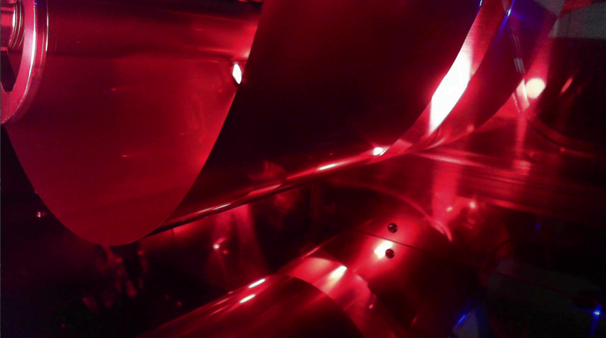 | 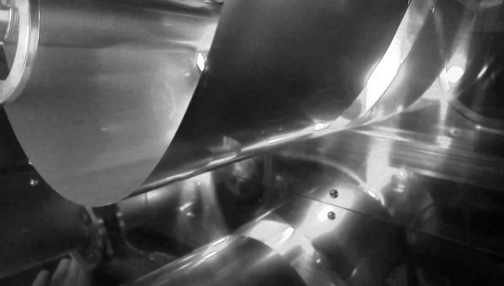 |

#### ROI (region of interest) 

Since the purpose of this report is to detect the level of tension in the rolling metal sheet, we set the ROI to detect only the edge of the rolling metal sheet.  In this report, a trapezoidal ROI was selected. The **ROI**  is extracted through a `bitwise_and` operation of the mask and the original image.

|                           ROI Mask                           |                          V Channel                           |                         Bitwise_and                          |
| :----------------------------------------------------------: | :----------------------------------------------------------: | :----------------------------------------------------------: |
| 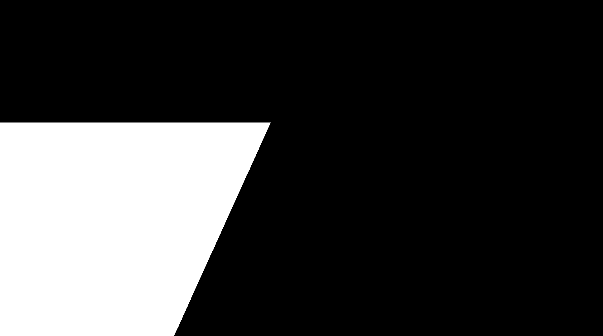 |  | 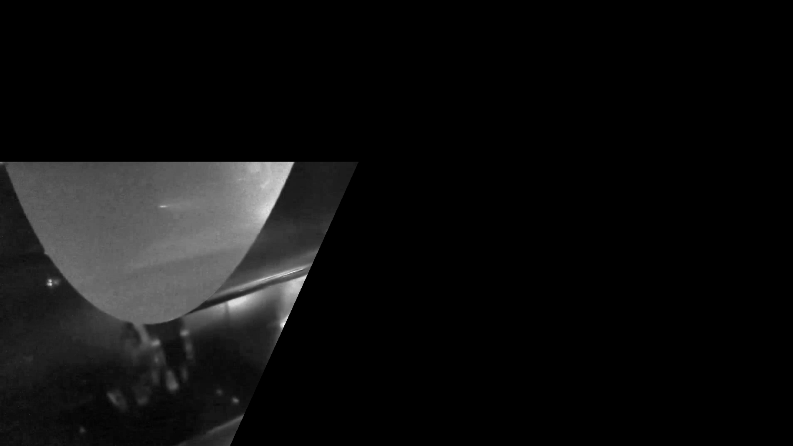 |

#### Sobel

Instead of the more commonly used **Canny** edge detector, the **Sobel** operator provides a more direct approach to capturing local intensity variations. The second differentiation was performed using `dx=2, dy=0` and `dx=0, dy=2` as parameters of the Sobel operator. The kernel size `ksize=3` was set.

|                           Sobel X                            |                           Sobel Y                            |                          Sobel_Edge                          |
| :----------------------------------------------------------: | :----------------------------------------------------------: | :----------------------------------------------------------: |
| 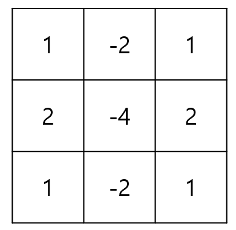 | 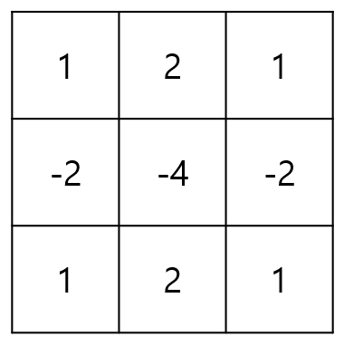 | 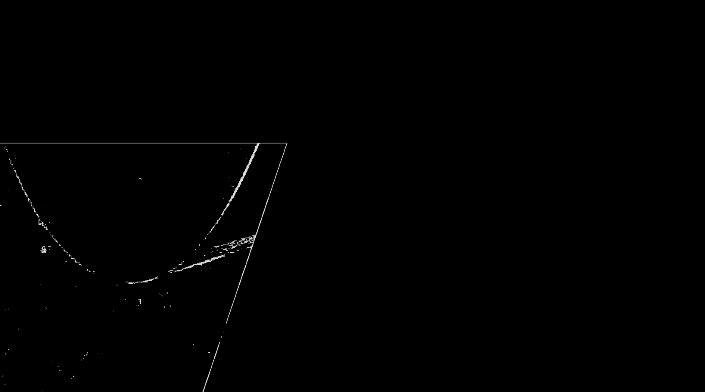 |

#### HoughlinesP

In this LAB, **Extended Hough Transform (HoughLinesP)** was applied to the edge image obtained through the Sobel operation to extract meaningful slanted straight line patterns on the metal surface. After that, only straight lines satisfying specific conditions were selected and visualized in the output image.

* HouglinesP parameter
  * Minimum Line Length : 30[px]
  * Maximum Line Gap  : 20[px]
* Gradient filtering 
  * Among the straight lines that occurred in the left area, only those with a slope greater than 5 degrees are displayed. 
  * In the right area, only lines with a negative slope and an absolute value between 30 and 65 degrees are extracted. This removes lines that are too steep or flat, and emphasizes only lines within a certain slope range.

#### Morphology (ERODE)

After going through the `HoughlinesP` process, a process to remove noise caused by various factors in the real environment is needed. The data to be poly fitting is prepared by removing noise using the `morphologyEx` function.

|                         HoughlinesP                          |                      Gradient Filtering                      |                            Erode                             |
| :----------------------------------------------------------: | :----------------------------------------------------------: | :----------------------------------------------------------: |
| 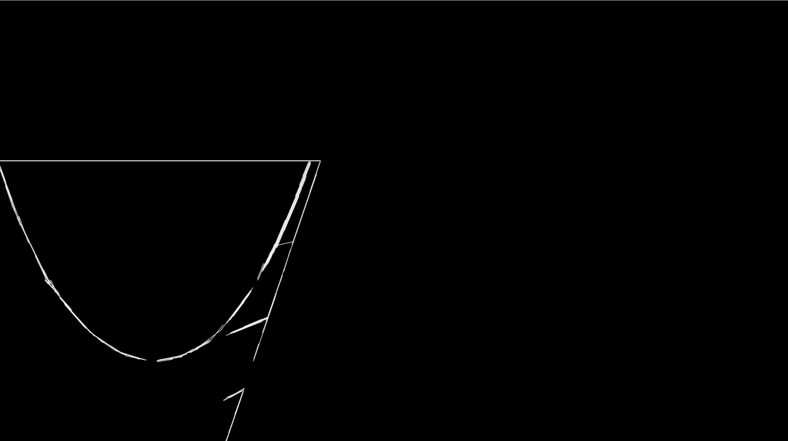 | 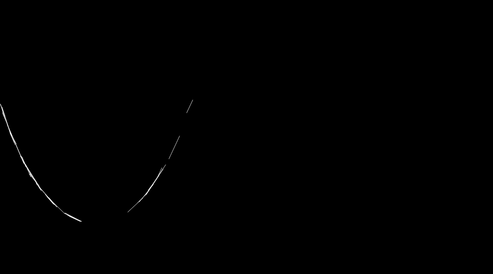 | 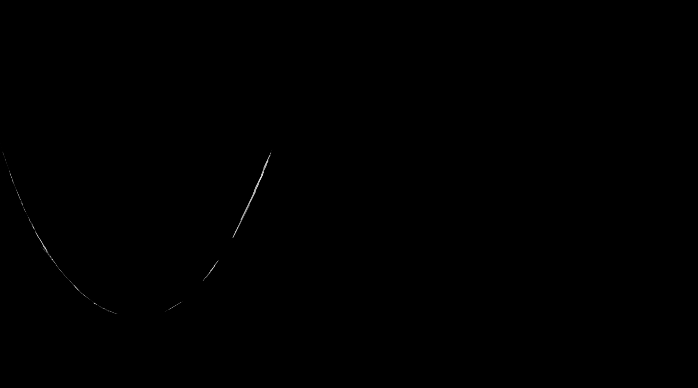 |

#### Poly Fitting

Using `HoughlinesP`, you can get multiple lines. Use linear regression to determine one curve. After you get one curve by doing a second-order poly fitting, you can calculate the score and level by finding the minimum point of this curve.

|                         2nd Poly Fit                         |                         Application                          |
| :----------------------------------------------------------: | :----------------------------------------------------------: |
| 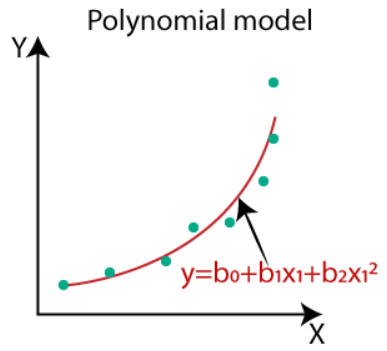 | 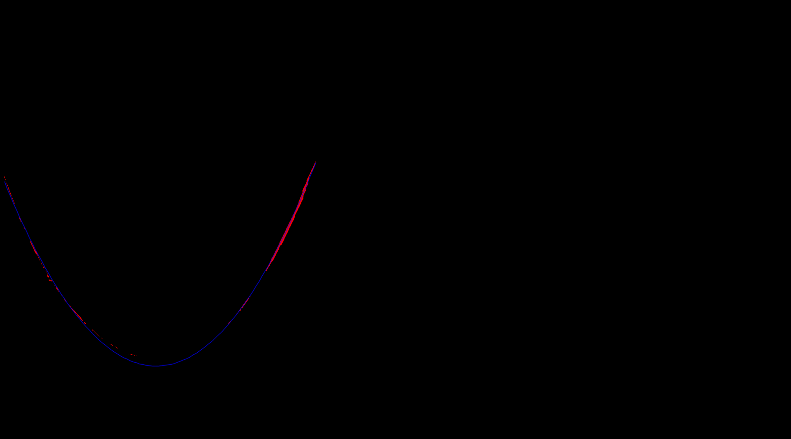 |


<hr>

## Result and Discussion

#### 1. Final Result

|                           Level 3                            |                           Level 2                            |                           Level 1                            |
| :----------------------------------------------------------: | :----------------------------------------------------------: | :----------------------------------------------------------: |
| 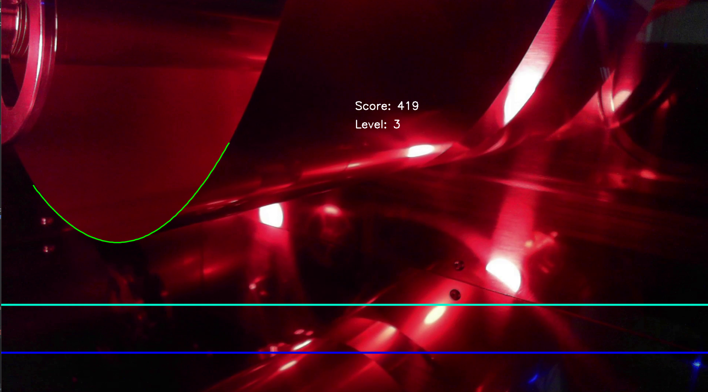 |  | 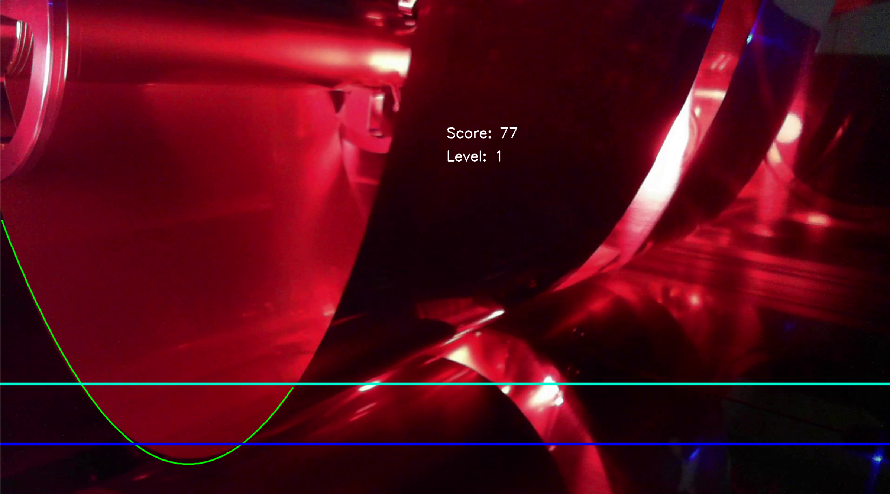 |

#### 2. Discussion

The core task of this report is to minimize unnecessary edge detection from other equipment elements in the image in order to precisely extract the curve of the Rolling Metal Sheet. To this end, this study applied three main techniques.

First, by adjusting the parameters of the Probabilistic Hough Transform (HoughLinesP), fragmentary or unnecessary straight line detection was suppressed. This controlled the sensitivity of detection and reduced the possibility of edges unrelated to the curve of the metal sheet, which is the actual area of interest.

Second, filtering was performed based on the slope (angle) of the detected straight lines to remove straight lines that were close to the horizontal or vertical direction. This was done considering that the outline of the equipment generally tends to appear in this direction, contributing to improving the accuracy of curve extraction.

Third, by applying the erosion technique, one of the morphological operations, fine noise and unnecessary detailed edges in the image were effectively removed. This improved the quality of the overall edge map and increased the reliability of curve detection in the subsequent processing stage.

|                            Before                            |                            After                             |
| :----------------------------------------------------------: | :----------------------------------------------------------: |
| 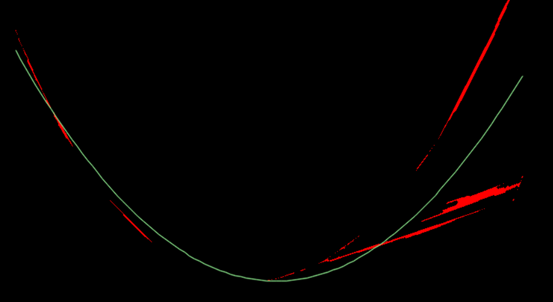 | 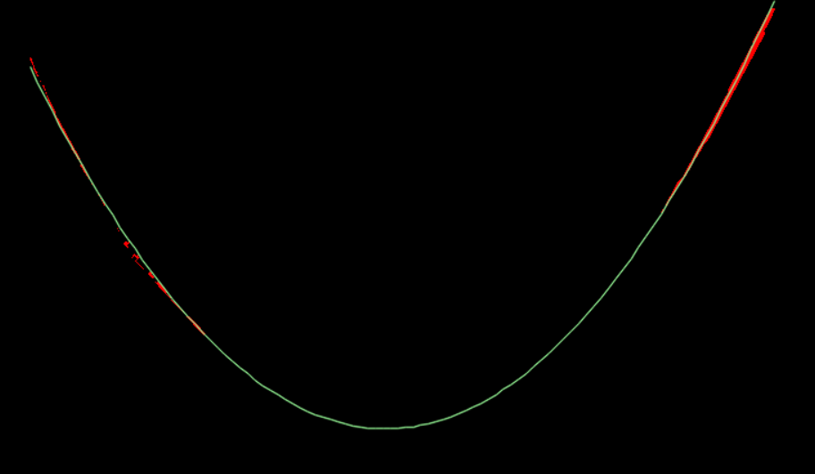 |

#### 

<hr>

## Appendix

```c++
def poly_fit(X, Y, n):
    if X.shape[0] != Y.shape[0] or X.ndim != 1 or Y.ndim != 1:
        raise ValueError("X and Y must be 1D arrays with the same length.")

    X = X.astype(np.float64)
    Y = Y.astype(np.float64)

    A = np.zeros((X.shape[0], n + 1), dtype=np.float64)
    for i in range(X.shape[0]):
        x_val = X[i]
        for j in range(n + 1):
            A[i, j] = x_val ** (n - j)

    c, _, _, _ = np.linalg.lstsq(A, Y, rcond=None)
    return c
```

X and Y must be of the same length and be one-dimensional arrays.  Convert X and Y to float64 type for precision and stability of calculations.

1. Given Data Points

$$
(x_1,y_1), (x_2,y_2),\cdots, (x_m,y_m)
$$

2. 2th degree polynomial
   $$
   y=c_0x^2+c_1x+c_2
   $$

3. $$
   A = \begin{bmatrix} x_1^2 & x_1^1 & x_1^0 \\ x_2^2 & x_2^1 & x_2^0 \\ \vdots & \vdots \\ x_m^2 & x_m^1 & x_m^0 \end{bmatrix}, Y=\begin{bmatrix}y_1\\y_2\\\vdots\\y_m\end{bmatrix}
   $$

4. $$
   A^TA\cdot C=A^TY
   $$

$$
C=(A^TA)^{-1}A^TY
$$

```python
# ============================================== Open the Video File ================================================ #
cap = cv.VideoCapture('LAB3_Video.mp4')
# =================================================== While loop ===================================================== #
while cap.isOpened():
    # Read a single frame from the video
    ret, frame = cap.read()
    
    # If frame not read successfully (end of video), break the loop
    if not ret:
        break
    # ================================================= Preprocessing ================================================= #
    # Convert the current frame from BGR color space to HSV color space
    hsv = cv.cvtColor(frame, cv.COLOR_BGR2HSV)

    # Split the HSV image into three channels: Hue, Saturation, and Value (Brightness)
    src_h, src_s, src_v = cv.split(hsv)

    # Get the height and width of the V channel (grayscale-like image)
    [src_height, src_width] = src_v.shape

    # Define a trapezoid-shaped Region of Interest (ROI) as a polygon using 4 points
    pts = np.array([[ 
        [0, 390],                                  # Upper-left
        [int(src_width / 2 - 150), 390],           # Upper-right
        [int(2 * src_width / 7), src_height],      # Bottom-right
        [0, src_height]                            # Bottom-left
    ]], dtype=np.int32)

    # Create a black mask with the same size as the V channel
    mask = np.zeros_like(src_v)
    cv.fillPoly(mask, pts, 255)

    # Apply the mask to the V channel to isolate the ROI area
    roi = cv.bitwise_and(src_v, mask)

    # =========================================== Sobel Edge Detection ================================================ #
    # Apply the Sobel operator to detect edges using second-order derivative
    sobelx = cv.Sobel(roi, cv.CV_64F, 2, 0, ksize=3)
    sobely = cv.Sobel(roi, cv.CV_64F, 0, 2, ksize=3)

    magnitude = cv.magnitude(sobelx, sobely)

    # Clip the magnitude to the 0-255 range and convert to 8-bit unsigned integer for display
    magnitude = np.uint8(np.clip(magnitude, 0, 255))
    # Apply a binary threshold: pixels above 60 become 220 (white), others become 0 (black)
    threshold, sobel_edges = cv.threshold(magnitude, 60, 220, cv.THRESH_BINARY)

```

This code aims to set a trapezoidal ROI based on brightness information in the lower area of the image, and perform Sobel edge detection on that area to detect the curve.

1. The image that has gone through `cvtColor` and `inRange` pre-processing is used to extract only the pixels within a specified `HSV` range corresponding to the cloak color.
2. Preprocessing: HSV conversion and brightness channel extraction
3. Defining a Region of Interest (ROI)
4. Sobel edge detection, edge image normalization and thresholding

```python
# ================================================ HoughLinesP ===================================================== #
    # Create an empty image to draw the detected lines
    dstP = np.zeros_like(src_v)
    linesP = cv.HoughLinesP(sobel_edges, 1, np.pi / 180, 10, None, 30, 20)

    roi_center_x = int((src_width / 2 - 100) / 2)

    if linesP is not None:
        for i in range(0, len(linesP)):
            # Extract the endpoints of the line segment
            l = linesP[i][0]
            x1, y1, x2, y2 = l

            # Calculate the angle of the line in degrees
            dx = x2 - x1
            dy = y2 - y1
            angle = np.arctan2(dy, dx) * 180 / np.pi

            # ========================= Line Filtering by Position and Angle ========================= #
            if x1 < roi_center_x and x2 < roi_center_x:
                # Filter out near-horizontal and near-vertical lines
                if angle > 5 and abs(angle) < 70:
                    cv.line(dstP, (x1, y1), (x2, y2), (255, 255, 255), 1, cv.LINE_AA)

            # Check if the line is on the right side of ROI
            elif x1 > roi_center_x and x2 > roi_center_x:
                # Filter out undesired angles and retain diagonally descending lines
                if angle < -5 and 30 < abs(angle) < 65:
                    cv.line(dstP, (x1, y1), (x2, y2), (255, 255, 255), 1, cv.LINE_AA)
# ================================================ Morphology ==================================================== #
    # Create a structuring element of type 'CROSS' with a 3x3 size
    kernel = cv.getStructuringElement(cv.MORPH_CROSS, (3, 3))
    dstP = cv.morphologyEx(dstP, cv.MORPH_ERODE, kernel, iterations=2)
```

In this code, we aim to highlight the line structure of the image through straight line detection and morphological processing, and obtain a more accurate line distribution by removing noise and unnecessary lines.

1. HoughLinesP (Hough Transform Line Detection)
2. Filter and draw the line for poly fitting
3. Morphology Erosion

```python
# ================================================ Poltfitting ====================================================#
    white_pixels = np.argwhere(dstP > 100)

    if white_pixels is not None:
        # Extract the y (row) and x (column) values of the white pixels
        y_values = white_pixels[:, 0]  # Row indices of white pixels
        x_values = white_pixels[:, 1]  # Column indices of white pixels
        # Fit a polynomial (2nd degree) to the white pixels' coordinates
        curve_mask = np.zeros_like(src_v)
        coeff = poly_fit(x_values, y_values, 2)

        curve_x = np.linspace(min(x_values), max(x_values), 100)
        curve_y = coeff[0] * curve_x ** 2 + coeff[1] * curve_x + coeff[2]
        # Combine the x and y values to get the curve points
        curve_points = np.array([curve_x, curve_y], dtype=np.int32).T

        # Draw the fitted curve on the curve_mask
        cv.polylines(curve_mask, [curve_points], isClosed=False, color=255, thickness=1, lineType=cv.LINE_AA)
        cv.polylines(frame, [curve_points], isClosed=False, color=(0, 255, 0), thickness=2, lineType=cv.LINE_AA)
```

This code detects white lines in the image, then fits a curve using a second-order polynomial and plots it on the original image, which is then used to calculate the score and level.